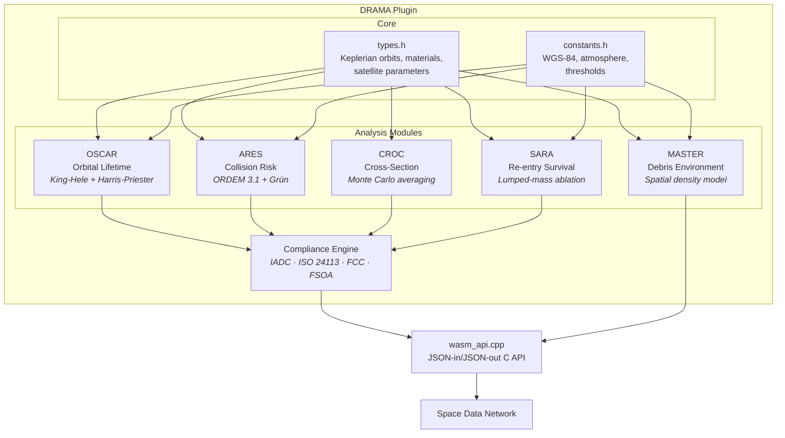

# DRAMA — Debris Risk Assessment and Mitigation Analysis

> ESA DRAMA-equivalent space debris mitigation analysis suite for the Space Data Network.

An open-source C++17/WASM implementation of the six core modules from ESA's [DRAMA software suite](https://sdup.esoc.esa.int/drama/), providing orbital lifetime prediction, collision risk assessment, cross-section computation, re-entry survival analysis, debris environment modeling, and multi-guideline regulatory compliance checking.

## Modules

| Module | Full Name | Description |
|--------|-----------|-------------|
| **OSCAR** | Orbital Spacecraft Active Removal | Orbital lifetime prediction using King-Hele decay theory with Harris-Priester atmosphere |
| **ARES** | Assessment of Risk Event Statistics | Debris/meteoroid collision flux and probability using NASA ORDEM 3.1 + Grün models |
| **CROC** | Cross-Section of Complex Bodies | Projected cross-section via Monte Carlo random-tumbling averaging of geometric primitives |
| **SARA** | Survival Analysis for Re-entry Applications | Lumped-mass ablation re-entry model with casualty risk computation |
| **MASTER** | Meteoroid and Space Debris Terrestrial Environment Reference | Spatial density, altitude profiles, and size distributions for the debris/meteoroid environment |
| **Compliance** | Regulatory Compliance Assessment | Automated checking against IADC, ISO 24113, FCC, and FSOA guidelines |

## Compliance Guidelines

The compliance module checks spacecraft missions against all major debris mitigation frameworks:

| Guideline | Authority | Key Requirements | Reference |
|-----------|-----------|-----------------|-----------|
| **IADC Debris Mitigation Guidelines** | IADC (Inter-Agency) | 25-year PMD, passivation, casualty risk < 1e-4, GEO graveyard | IADC-02-01 Rev 3 (2021) |
| **ISO 24113:2019** | ISO | 25-year PMD, breakup probability < 0.001/yr, casualty risk < 1e-4 | ISO 24113:2019 |
| **FCC 25-Year Rule** | FCC (United States) | 25-year post-mission disposal, collision risk disclosure | 47 CFR §25.114(d)(14) |
| **French Space Operations Act** | CNES (France) | 25-year PMD, passivation, casualty risk < 1e-4 | Loi n° 2008-518 (FSOA/LOS) |

## Architecture



## WASM API

All functions accept a JSON string input and return a JSON string output (caller must `free()` the result).

| Function | Module | Description |
|----------|--------|-------------|
| `compute_lifetime_json()` | OSCAR | Compute orbital lifetime with full decay history |
| `check_25yr_compliance_json()` | OSCAR | Quick 25-year rule compliance check |
| `compute_flux_json()` | ARES | Compute debris and meteoroid flux by size bin |
| `compute_collision_risk_json()` | ARES | Collision probability for a given cross-section |
| `compute_cross_section_json()` | CROC | Average cross-section for geometric primitives |
| `compute_average_cross_section_json()` | CROC | Monte Carlo tumbling-average cross-section |
| `analyze_reentry_json()` | SARA | Re-entry survival with fragment-level detail |
| `compute_casualty_risk_json()` | SARA | Casualty expectation from re-entry |
| `get_environment_json()` | MASTER | Debris environment spatial density and size distribution |
| `check_compliance_json()` | Compliance | Full multi-guideline compliance report |

## Build

### Prerequisites

- CMake ≥ 3.16
- C++17 compiler (Clang, GCC)
- Emscripten SDK (auto-installed by `build.sh` via `deps/emsdk` submodule)

### Native build (tests)

```bash
cd src/cpp
mkdir -p build && cd build
cmake ..
make -j$(nproc)
./test_drama
```

### WASM build

```bash
./build.sh          # first run installs emsdk
./build.sh --clean  # clean rebuild
```

## Physical Models & References

### OSCAR — Orbital Lifetime
- **Decay theory**: King-Hele, D.G. *Satellite Orbits in an Atmosphere: Theory and Applications*, Blackie, 1987
- **Atmosphere**: Harris-Priester model (CIRA-72 based), tabulated 100–2000 km
- **Solar activity**: 11-year sinusoidal cycle (Cycle 25 reference), configurable F10.7/Ap
- **Reference**: Vallado, D.A. *Fundamentals of Astrodynamics*, 4th ed., Chapter 9

### ARES — Collision Risk
- **Debris flux**: NASA ORDEM 3.1 power-law parametric fit (Krisko, P.H., AIAA 2014-4227)
- **Meteoroid flux**: Grün et al. (1985), *Icarus* 62, 244–272
- **Collision probability**: Poisson statistics (Kessler, 1981, NASA JSC-20001)

### CROC — Cross-Section
- **Primitives**: Box, cylinder, sphere, flat panel with analytical projected area
- **Averaging**: Monte Carlo uniform sampling on unit sphere (Cauchy's formula validation)
- **Reference**: Klinkrad, H. *Space Debris: Models and Risk Analysis*, Springer, 2006, §4.3

### SARA — Re-entry Survival
- **Heating**: Detra-Kemp-Riddell stagnation-point correlation (Sutton-Graves constant)
- **Ablation**: Lumped-mass thermal model with latent heat of fusion
- **Casualty area**: NASA-STD-8719.14A, §4.7 — π × (0.6 + √(A_frag/π))²
- **Reference**: Lips, T. & Fritsche, B. *Acta Astronautica* 57, 312–323 (2005)

### MASTER — Debris Environment
- **Spatial density**: Two-Gaussian fit to MASTER-8/ORDEM 3.1 (peaks at 825 km, 1400 km)
- **Size distribution**: Power-law α ≈ 2.6 (explosion fragments)
- **Reference**: Flegel, S. et al. *The MASTER-2009 Space Debris Environment Model*, ESA SP-672

### Compliance
- IADC-02-01 Rev 3 (2021) — Inter-Agency Space Debris Coordination Committee
- ISO 24113:2019 — Space systems — Space debris mitigation requirements
- 47 CFR §25.114(d)(14) — FCC orbital debris mitigation rules
- Loi n° 2008-518 — French Space Operations Act (FSOA/LOS)

## Project Structure

```
plugins/drama/
├── README.md                  # This file
├── LICENSE                    # MIT License
├── plugin-manifest.json       # SDN plugin manifest
├── build.sh                   # WASM build script (auto-installs emsdk)
├── .gitignore
└── src/
    ├── wasm_api.cpp            # Emscripten C-API exports (JSON in/out)
    └── cpp/
        ├── CMakeLists.txt      # Native + WASM build configuration
        ├── include/
        │   ├── types.h         # Core data types (orbits, materials, configs, results)
        │   └── constants.h     # Physical constants (WGS-84, atmosphere, thresholds)
        ├── src/
        │   ├── types.cpp       # Type member function implementations
        │   ├── oscar.cpp       # OSCAR — orbital lifetime (King-Hele decay)
        │   ├── ares.cpp        # ARES — collision risk (ORDEM + Grün flux)
        │   ├── croc.cpp        # CROC — cross-section (Monte Carlo)
        │   ├── sara.cpp        # SARA — re-entry survival (ablation model)
        │   ├── master.cpp      # MASTER — debris environment model
        │   └── compliance.cpp  # Regulatory compliance (IADC/ISO/FCC/FSOA)
        └── tests/
            └── test_drama.cpp  # Comprehensive test suite with cited references
```

## License

MIT — see [LICENSE](./LICENSE).
